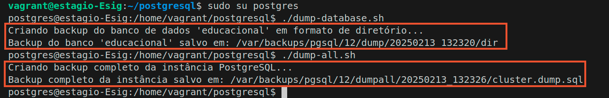
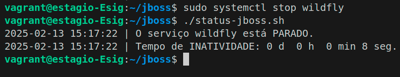
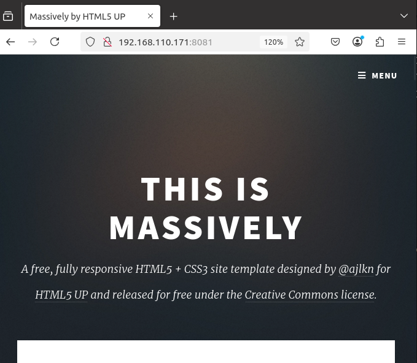

# Estágio em Infraestrutura - Atividade Técnica

Este repositório contém os scripts e documentação necessários para a realização da atividade técnica proposta para a vaga de estágio em infraestrutura no ESIG Group. A atividade consiste em criar scripts para realizar o dump e restore de um banco de dados PostgreSQL, além de verificar o status das instâncias do JBoss e Tomcat.

## Pré Rquisitos
Vagrant v2.4.0 <p>
Virtualbox v7.0.22 r165102 <p>


## Requisitos da Atividade

### 1 - Dump e Restore de Banco de Dados PostgreSQL

1. **Criação do Banco de Dados**: Crie um banco de dados PostgreSQL com pelo menos uma tabela de exemplo.
2. **Script de Dump**: Escreva um script que faça o dump deste banco de dados.
3. **Script de Restore**: Escreva um script que restaure o banco de dados a partir do dump gerado.

### 2 - Verificação de Instâncias do JBoss e Tomcat

1.  **Verificação de Status**: Escreva scripts que verifiquem se as instâncias do JBoss e Tomcat estão rodando em um servidor.
2.  **Condição Extra**: Atualize o script anterior para que, caso a instância esteja parada por mais de 1 minuto, ela seja inicializada automaticamente.
3.  **Informações de Retorno**: Os scripts devem retornar informações básicas como status da instância e tempo de atividade.

## Configuração do Ambiente

#### Instalação do Virtualbox
Execute os seguinte comandos para instalação do virtual box, ou acesse a página e realize o [download](https://www.virtualbox.org/wiki/Download_Old_Builds_7_0): <p>

```bash
sudo apt update
sudo apt upgrade -y
sudo apt install git tree unzip -y 

wget https://download.virtualbox.org/virtualbox/7.0.22/virtualbox-7.0_7.0.22-165102~Ubuntu~focal_amd64.deb

sudo dpkg -i virtualbox-7.0_7.0.22-165102~Ubuntu~focal_amd64.deb
```
#### Instalação do Vagrant
Execute os seguinte comandos para instalação do vagrant ou acese a págine e realize o [download](https://developer.hashicorp.com/vagrant/install): <p>
```
$ wget https://releases.hashicorp.com/vagrant/2.4.0/vagrant_2.4.0_linux_amd64.zip
$ unzip vagrant_2.4.0_linux_amd64.zip
$ sudo mv vagrant /usr/local/bin/
```

## Criação das máquinas virtuais

### Considerações:
- A instalação do Jboss e do Banco de dados serão feita em **Baremetal**, já o Tomcat será feito em um  **container** 
- As máquinas virtuais serão provisionadas via Vagrantfile <p>

1 - Faça o clone do repositório
```
git clone https://github.com/fllavioandrade/estagio-esig 
cd estagio-esig
git checkout developer
```
2 - Provisionar a máquina onde será instalado as  aplicações em baremetal
 ```
cd vagrant
vagrant up
 ```
2.1 Após provisionar a máquina você pode acessá-la com o comando <code>vagrant ssh </code>

## Criação do dump do banco de dados

- Acesse o diretório <code> /home/vagrant/postgresql/ </code> mude para o usuário <code>postgres</code> e execute o script <code>dump-database.sh</code> e <code>dump-all.sh</code>, conforme o mostrado abaixo:

```
cd /home/vagrant/postgresql/
sudo su postgres
./dump-database.sh
./dump-all.sh
```


- Podemos ver os arquivos criador usando o comando <code> tree </code>

<p>

### Scripts utilizados
#### dump-databse.sh

```
#!/bin/bash

# Configurações
DB_NAME="educacional"  # Nome do banco de dados
BACKUP_BASE_DIR="/var/backups/pgsql"  # Diretório base para backups
PGMAJOR=12
TIMESTAMP=$(date +"%Y%m%d_%H%M%S")  # Timestamp para evitar sobrescrita de backups

# Diretório de backup
BACKUP_DIR="$BACKUP_BASE_DIR/$PGMAJOR/dump/$TIMESTAMP"
BACKUP_DIR_DIR="$BACKUP_DIR/dir"

# Criar diretório de backup
mkdir -p "$BACKUP_DIR_DIR"

# Backup em formato de diretório (parallel)
echo "Criando backup do banco de dados '$DB_NAME' em formato de diretório..."
pg_dump -j7 -Fd "$DB_NAME" -f "$BACKUP_DIR_DIR"
echo "Backup do banco '$DB_NAME' salvo em: $BACKUP_DIR_DIR"
```
#### dump-all.sh
```
#!/bin/bash

# Configurações
BACKUP_BASE_DIR="/var/backups/pgsql"  # Diretório base para backups
PGMAJOR=12
TIMESTAMP=$(date +"%Y%m%d_%H%M%S")  # Timestamp para evitar sobrescrita de backups

# Diretório de backup para a instância completa
BACKUP_DIR_ALL="$BACKUP_BASE_DIR/$PGMAJOR/dumpall/$TIMESTAMP"

# Criar diretório de backup
mkdir -p "$BACKUP_DIR_ALL"

# Backup de toda a instância PostgreSQL
echo "Criando backup completo da instância PostgreSQL..."
pg_dumpall > "$BACKUP_DIR_ALL/cluster.dump.sql"
echo "Backup completo da instância salvo em: $BACKUP_DIR_ALL/cluster.dump.sql"

```


## Realizando o restore do banco de dados


- Com isso, já podemos excluir nosso database

```
dropdb educacional
psql -d educacional

# A saída deve ser:
# psql: error: FATAL:  database "educacional" does not exist
```
#### Executando o script de restore.
- Agora vamos restaurar a tabela usando o restore-databse.sh.

```
sudo su postgres
./restore-database.sh
psql -d educacional

```
<p>

- Vamos listar os database, em seguida deletar a <code> educacional</code> novamente.

```
\l
EXIT
dropdb educacional
```

- Agora vamos restaurar usando o restore-all.sh
```
./restore-all
```
<p>

## Usando o Crontab para automatizar o dump.
Para que o dump possa ocorrer de forma automática, podemos configurar o crontab para agendar a execução do script.

- Com o usuário padrão da máquina acesse o seguinte arquivo <code> sudo vim /etc/crontab</code> e adicione uma linha no final do arquivo com a seguinte informação:
```
00 12 * * * postgres /home/vagrant/dump-all.sh
```
Essa linha informa que o script <code>dump-all.sh</code> pelo usuário <code>postgres</code> será executado <code>todos os dias, às 12:00h</code>
<p>

# Verificação de Instâncias do JBoss e Tomcat

## Instalação do Jboss
1.  Instalação do JDK
```
sudo apt install openjdk-17-jdk
java --version
```
2. Download WildFly (Jboss)
```
WILDFLY_RELEASE=$(curl -s https://api.github.com/repos/wildfly/wildfly/releases/latest|grep tag_name|cut -d '"' -f 4)

wget https://github.com/wildfly/wildfly/releases/download/${WILDFLY_RELEASE}/wildfly-${WILDFLY_RELEASE}.tar.gz

tar xvf wildfly-${WILDFLY_RELEASE}.tar.gz

sudo mv wildfly-${WILDFLY_RELEASE} /opt/wildfly
```
3. Configure o Systemd para o  WildFly
```
sudo groupadd --system wildfly
sudo useradd -s /sbin/nologin --system -d /opt/wildfly  -g wildfly wildfly
sudo mkdir /etc/wildfly

sudo cp /opt/wildfly/docs/contrib/scripts/systemd/wildfly.conf /etc/wildfly/
sudo cp /opt/wildfly/docs/contrib/scripts/systemd/wildfly.service /etc/systemd/system/
sudo cp /opt/wildfly/docs/contrib/scripts/systemd/launch.sh /opt/wildfly/bin/
sudo chmod +x /opt/wildfly/bin/launch.sh

sudo chown -R wildfly:wildfly /opt/wildfly

sudo systemctl daemon-reload
```
4. iniciar o serviço e verificar o status
```
sudo systemctl start wildfly
sudo systemctl enable wildfly
sudo systemctl status wildfly
```
<p>

### Acessar a página web do WildFly - Jboss
para acessar a página, temos que ver o ip da nossa máquina virtual, lembrando que VM tem umna interface em bridge, logo ela vai ter um IP dentro da faixa de rede de seu computador, no meu caso é o <code>192.168.110.19</code>.

<p>
basta acessarmos apágina web com o seguinte endereço <code>http://IPdaVM:8080</code>

<p>


## Criação do script para verificar o status do jboss
1. Crie um arquivo chamado <code>status-jboss.sh</code> e adicione o seguinte script.

```
vim status-jboss.sh
```
```
#!/bin/bash

# Nome do serviço (no caso, WildFly)
NOME_SERVICO="wildfly"

# Verifica o status do serviço
STATUS=$(systemctl is-active "$NOME_SERVICO")

# Função para calcular o tempo decorrido em formato legível
calcular_tempo_atividade() {
    local tempo_inicio=$1
    local tempo_atual=$(date +%s)
    local segundos_atividade=$((tempo_atual - tempo_inicio))
    echo $(printf "%dd %dh %dm %ds" $((segundos_atividade/86400)) $((segundos_atividade%86400/3600)) $((segundos_atividade%3600/60)) $((segundos_atividade%60)))
}

# Se o serviço estiver rodando
if [ "$STATUS" = "active" ]; then
    # Obtém o timestamp de quando o serviço foi iniciado
    TEMPO_INICIO=$(systemctl show -p ActiveEnterTimestamp --value "$NOME_SERVICO")

    # Converte o timestamp para segundos
    TEMPO_INICIO_SEGUNDOS=$(date -d "$TEMPO_INICIO" +%s)

    # Calcula o tempo de atividade
    TEMPO_ATIVIDADE=$(calcular_tempo_atividade "$TEMPO_INICIO_SEGUNDOS")

    echo "O serviço $NOME_SERVICO está rodando."
    echo "Tempo de atividade: $TEMPO_ATIVIDADE"

# Se o serviço estiver parado
elif [ "$STATUS" = "inactive" ]; then
    # Obtém o timestamp de quando o serviço foi parado
    TEMPO_PARADA=$(systemctl show -p InactiveEnterTimestamp --value "$NOME_SERVICO")

    # Converte o timestamp para segundos
    TEMPO_PARADA_SEGUNDOS=$(date -d "$TEMPO_PARADA" +%s)

    # Calcula há quanto tempo o serviço está parado
    TEMPO_ATUAL=$(date +%s)
    TEMPO_DESDE_PARADA=$((TEMPO_ATUAL - TEMPO_PARADA_SEGUNDOS))

    echo "O serviço $NOME_SERVICO está parado."
    echo "Tempo desde que foi parado: $(calcular_tempo_atividade "$TEMPO_PARADA_SEGUNDOS")"

    # Chama o script de inicialização se o serviço estiver parado há mais de 1 minuto
    if [ "$TEMPO_DESDE_PARADA" -gt 60 ]; then
        echo "O serviço está parado há mais de 1 minuto. Iniciando o serviço..."
        ./start-jboss.sh
    fi

# Se o serviço estiver em outro estado (ex.: falhou)
else
    echo "O serviço $NOME_SERVICO está em estado desconhecido: $STATUS"
fi
```
2. Dê a esse arquivo permissão de execução
```
sudo chmod +x status-jboss.sh
```
3. Execute o script
```
./status-jboss.sh
```
<p>

4. Vamos parar o serviço e ver o tempo de inatividade
```
sudo systemctl stop wildfly
./status-jboss.sh
```
<p>

5. Agora vamos criar um script para que o serviço seja inicializado, caso o temo de inatividade seja maior que 1 minuto.
```
vim start-jboss.sh
```
```
#!/bin/bash

# Nome do serviço (no caso, WildFly)
NOME_SERVICO="wildfly"

# Tenta iniciar o serviço
systemctl start "$NOME_SERVICO"

# Verifica se o serviço foi iniciado com sucesso
if [ $? -eq 0 ]; then
    echo "Serviço $NOME_SERVICO iniciado com sucesso."
else
    echo "Falha ao iniciar o serviço $NOME_SERVICO."
fi
```

6. Dê a esse arquivo permissão de execução
```
sudo chmod +x start-jboss.sh
```
- <strong>OBS: o script para verificar o status <code>status-jboss.sh</code> verifica se o serviço está inativo por mais de 1 minuto, caso esteja ele executa o script <code>start-jboss.sh</code> para inicializar o serviço. </strong> 
<p>

7. Como na etapa 4 nós paramos o jboss, vamos verificar seu estado com o <code>status-jboss.sh</code>, caso o serviço esteja indisponível por mais de 1 minuto, será executado de forma automática o <code>start-jboss.sh</code>.
```
./status-jboss.sh
./status-jboss.sh
systemctl status wildfly.service 
```
<p>

8 - Similar ao que fizemos com o PostgreSQL usando o contrab, podemos também fazer para o jboss para que o script seja executado a cada 1 minuto.
- Com o usuário padrão da máquina acesse o seguinte arquivo <code> sudo vim /etc/crontab</code> e adicione uma linha no final do arquivo com a seguinte informação:
```
* * * * * vagrant /home/vagrant/status-jboss.sh
```
Essa linha informa que o script <code>dump-all.sh</code> pelo usuário <code>postgres</code> será executado <code>todos os dias, às 12:00h</code>
<p>

## Instalação do Tomcat
O serviço do Tomcat será por meio de um container Docker e ele vai responder na porta 8081, pois a 8080 já está sendo utilizada pelo Jboss.

### Instalação do [docker e docker compose](https://docs.docker.com/engine/install/ubuntu/)

```
# Add Docker's official GPG key:
sudo apt-get update
sudo apt-get install ca-certificates curl
sudo install -m 0755 -d /etc/apt/keyrings
sudo curl -fsSL https://download.docker.com/linux/ubuntu/gpg -o /etc/apt/keyrings/docker.asc
sudo chmod a+r /etc/apt/keyrings/docker.asc

# Add the repository to Apt sources:
echo \
  "deb [arch=$(dpkg --print-architecture) signed-by=/etc/apt/keyrings/docker.asc] https://download.docker.com/linux/ubuntu \
  $(. /etc/os-release && echo "${UBUNTU_CODENAME:-$VERSION_CODENAME}") stable" | \
  sudo tee /etc/apt/sources.list.d/docker.list > /dev/null
sudo apt-get update
```
```
sudo apt-get install docker-ce docker-ce-cli containerd.io docker-buildx-plugin docker-compose-plugin
```
### Criando um docker compose para o tomcat e subindo o serviço via container.
- Agora vamos criar o docker compose para subir o container do tomcat.
```
mkdir tomcat
vim docker-compose.yml
```
```
version: '3.8'

services:
  tomcat:
    image: tomcat:latest
    container_name: tomcat-server
    volumes:
      - ./tomcat:/usr/local/tomcat/webapps/ROOT  # Mapeia o diretório tomcat para o diretório ROOT do Tomcat
    ports:
      - "8081:8080"  # HTTP para aplicações (mapeia 8081 no host para 8080 no contêiner)
    networks:
      - app-network

networks:
  app-network:
    driver: bridge
```
- Apenas para termos didáticos, vamos realizar o download de um HTML do site https://html5up.net/ e exportá-la para o diretório tomcat.
```
wget https://html5up.net/massively/download
mv download tomcat/download.zip
cd tomcat
unzip download
```
- Agora vamos subir o container 
```
sudo docker compose up -d
```
- podemos ver o container do tomcat UP  com o comando <code>sudo docker container ls</code>e acessar a página web pela a seguinte URL http://IPdaVM:8081

<p>

<p>
