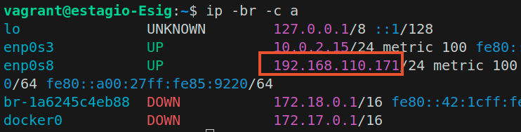
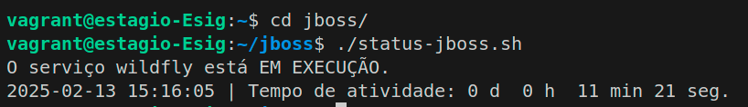
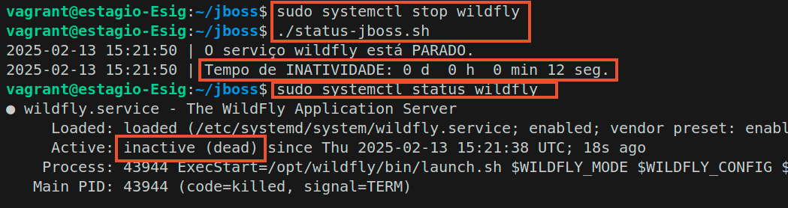
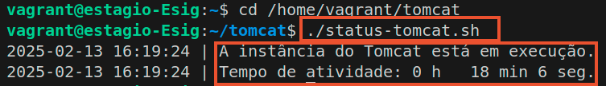

# Estágio em Infraestrutura - Atividade Técnica

Este repositório contém os scripts e documentação necessários para a realização da atividade técnica proposta para a vaga de estágio em infraestrutura no ESIG Group. A atividade consiste em criar scripts para realizar o dump e restore de um banco de dados PostgreSQL, além de verificar o status das instâncias do JBoss e Tomcat.

### OBSERVAÇÃO
- Este respositório instala todas as aplicações e dependências necessárias para que os scripts possam ser executados seguindo este README. Caso você queira verificar o passo a passo da instalação das dependencias e das aplicações, [clique aqui](https://github.com/FllavioAndrade/estagio-esig/tree/master).

## Pré Rquisitos
Vagrant v2.4.0 <p>
Virtualbox v7.0.22 r165102 <p>


## Requisitos da Atividade

### 1 - Dump e Restore de Banco de Dados PostgreSQL

1. **Criação do Banco de Dados**: Crie um banco de dados PostgreSQL com pelo menos uma tabela de exemplo.
2. **Script de Dump**: Escreva um script que faça o dump deste banco de dados.
3. **Script de Restore**: Escreva um script que restaure o banco de dados a partir do dump gerado.

### 2 - Verificação de Instâncias do JBoss e Tomcat

1.  **Verificação de Status**: Escreva scripts que verifiquem se as instâncias do JBoss e Tomcat estão rodando em um servidor.
2.  **Condição Extra**: Atualize o script anterior para que, caso a instância esteja parada por mais de 1 minuto, ela seja inicializada automaticamente.
3.  **Informações de Retorno**: Os scripts devem retornar informações básicas como status da instância e tempo de atividade.

## Configuração do Ambiente

#### Instalação do Virtualbox
Execute os seguinte comandos para instalação do virtual box, ou acesse a página e realize o [download](https://www.virtualbox.org/wiki/Download_Old_Builds_7_0): <p>

```bash
sudo apt update
sudo apt upgrade -y
sudo apt install git tree unzip -y 

wget https://download.virtualbox.org/virtualbox/7.0.22/virtualbox-7.0_7.0.22-165102~Ubuntu~focal_amd64.deb

sudo dpkg -i virtualbox-7.0_7.0.22-165102~Ubuntu~focal_amd64.deb
```
#### Instalação do Vagrant
Execute os seguinte comandos para instalação do vagrant ou acese a págine e realize o [download](https://developer.hashicorp.com/vagrant/install): <p>
```
$ wget https://releases.hashicorp.com/vagrant/2.4.0/vagrant_2.4.0_linux_amd64.zip
$ unzip vagrant_2.4.0_linux_amd64.zip
$ sudo mv vagrant /usr/local/bin/
```

## Criação das máquinas virtuais

### Considerações:
- A instalação do Jboss e do Banco de dados serão feita em **Baremetal**, já o Tomcat será feito em um  **container** 
- As máquinas virtuais serão provisionadas via Vagrantfile <p>

1 - Faça o clone do repositório
```
git clone https://github.com/fllavioandrade/estagio-esig 
cd estagio-esig
git checkout developer
```
2 - Provisionar a máquina onde será instalado as  aplicações em baremetal
 ```
cd vagrant
vagrant up
 ```
2.1 Após provisionar a máquina você pode acessá-la com o comando <code>vagrant ssh </code>

## Criação do dump do banco de dados

- Acesse o diretório <code> /home/vagrant/postgresql/ </code> mude para o usuário <code>postgres</code> e execute o script <code>dump-database.sh</code> e <code>dump-all.sh</code>, conforme o mostrado abaixo:

```
cd /home/vagrant/postgresql/
sudo su postgres
./dump-database.sh
./dump-all.sh
```


- Podemos ver os arquivos criador usando o comando <code> tree </code>

<p>

### Scripts utilizados
#### dump-databse.sh

```
#!/bin/bash

# Configurações
DB_NAME="educacional"  # Nome do banco de dados
BACKUP_BASE_DIR="/var/backups/pgsql"  # Diretório base para backups
PGMAJOR=12
TIMESTAMP=$(date +"%Y%m%d_%H%M%S")  # Timestamp para evitar sobrescrita de backups

# Diretório de backup
BACKUP_DIR="$BACKUP_BASE_DIR/$PGMAJOR/dump/$TIMESTAMP"
BACKUP_DIR_DIR="$BACKUP_DIR/dir"

# Criar diretório de backup
mkdir -p "$BACKUP_DIR_DIR"

# Backup em formato de diretório (parallel)
echo "Criando backup do banco de dados '$DB_NAME' em formato de diretório..."
pg_dump -j7 -Fd "$DB_NAME" -f "$BACKUP_DIR_DIR"
echo "Backup do banco '$DB_NAME' salvo em: $BACKUP_DIR_DIR"
```
#### dump-all.sh
```
#!/bin/bash

# Configurações
BACKUP_BASE_DIR="/var/backups/pgsql"  # Diretório base para backups
PGMAJOR=12
TIMESTAMP=$(date +"%Y%m%d_%H%M%S")  # Timestamp para evitar sobrescrita de backups

# Diretório de backup para a instância completa
BACKUP_DIR_ALL="$BACKUP_BASE_DIR/$PGMAJOR/dumpall/$TIMESTAMP"

# Criar diretório de backup
mkdir -p "$BACKUP_DIR_ALL"

# Backup de toda a instância PostgreSQL
echo "Criando backup completo da instância PostgreSQL..."
pg_dumpall > "$BACKUP_DIR_ALL/cluster.dump.sql"
echo "Backup completo da instância salvo em: $BACKUP_DIR_ALL/cluster.dump.sql"

```

## Realizando o restore do banco de dados

- Com isso, já podemos excluir nosso database

```
dropdb educacional
psql -d educacional

# A saída deve ser:
# psql: error: FATAL:  database "educacional" does not exist
```
#### Executando o script de restore.
- Agora vamos restaurar a tabela usando o restore-databse.sh, o qual restaura uma tabela específica (no nosso caso, a tabela <code>educacional</code>).

```
./restore-database.sh
psql -d educacional

```
<p>

- Vamos deletar a database <code> educacional</code> novamente.

```
EXIT
dropdb educacional
```

- Agora vamos restaurar usando o restore-all.sh
```
./restore-all
```
<p>

## Usando o Crontab para automatizar o dump.
Para que o dump possa ocorrer de forma automática, podemos configurar o crontab para agendar a execução do script.

- Com o usuário padrão da máquina acesse o seguinte arquivo <code> sudo vim /etc/crontab</code> e adicione uma linha no final do arquivo com a seguinte informação:
```
00 12 * * * postgres /home/vagrant/postgreSQL/dump-all.sh
```
Essa linha informa que o script <code>dump-all.sh</code> pelo usuário <code>postgres</code> será executado <code>todos os dias, às 12:00h</code>
<p>

# Verificação de Instâncias do JBoss e Tomcat


### Acessar a página web do WildFly - Jboss
Para acessar a página, temos que ver o ip da nossa máquina virtual, lembrando que VM tem uma interface em bridge, logo, ela vai ter um IP dentro da faixa de rede de seu computador, no meu caso é o <code>192.168.110.171</code>.

<p>
Basta acessarmos a página web com o seguinte endereço <code>http://IPdaVM:8080</code>

<p>


### Consultando o status do jboss.
```
cd jboss
./status-jboss.sh
```
<p>

- Vamos parar o serviço e ver o tempo de inatividade
```
sudo systemctl stop wildfly
./status-jboss.sh
sudo systemctl status wildfly

```
<p>
- Para que o script <code>start-jboss.sh</code> funcione, faz-se necessário modificar as permissões para que ele possa ser executado como sudo, mas sem a necessidade de digitar a senha.
 - Execute o comando <code>sudo visudo</code> e  Adicione após a ultima linha:
```
vagrant ALL=(ALL) NOPASSWD: /home/vagrant/jboss/start-jboss.sh
```
- Vamos executar novamente o comando <code>status-jboss.sh</code>
```
./status-jboss.sh
systemctl status wildfly.service 
```
<p>

8 - Similar ao que fizemos com o PostgreSQL usando o crontab, podemos também fazer para o jboss para que o script seja executado a cada 1 minuto.
- Com o usuário padrão da máquina acesse o seguinte arquivo <code> sudo vim /etc/crontab</code> e adicione uma linha no final do arquivo com a seguinte informação:
```
* * * * * vagrant /home/vagrant/jboss/status-jboss.sh
```
Essa linha informa que o script <code>status-jboss.sh</code> será executado pelo usuário <code>vagrant</code>  <code> a cada 1 minuto</code>.

## Acessando a página webs do Tomcat
O serviço do Tomcat está em um container Docker respondendo na porta 8081, pois a 8080 já está sendo utilizada pelo Jboss.

- podemos ver o container do tomcat UP  com o comando <code>sudo docker container ls</code>e acessar a página web pela a seguinte URL http://IPdaVM:8081

<p>

<p>

- <strong> OBS: Esse site não é a página inicial do tomcat, mas foi realizado o [download de um template do html](https://html5up.net/massively/download) e exportado para dentro do container. </strong>

### Consultando o status do Tomcat.
- Vamos acessar o diretório <code>/home/vagrant/tomcat </code> e executar o script <code> status-tomcat.sh</code>.

```
cd /home/vagrant/tomcat
./status-tomcat.sh
```
<p>

- Agora vamos parar o Container, aguardar 1 minuto e executar o script <code>status-tomcat.sh</code> novamente.

```
sudo docker container stop tomcat-server 
./status-tomcat.sh
./status-tomcat.sh
sudo docker container ls -a
```
<p>

## Gerenciado os logs da automação.
Podemos gerenciar os logs da automação do Tomcat e do Jboss para posteriormente serem visualizadas por alguma aplicação, como, por exemplo, o Grafana Loki.

- Inicialmente vamos criar os diretórios para armazenar as saídas dos scripts.

```
mkdir -p /home/vagrant/
```